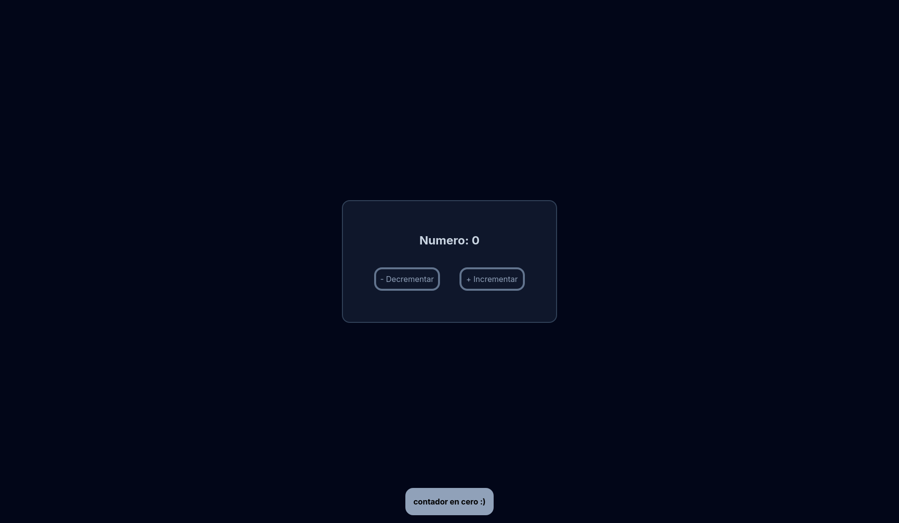
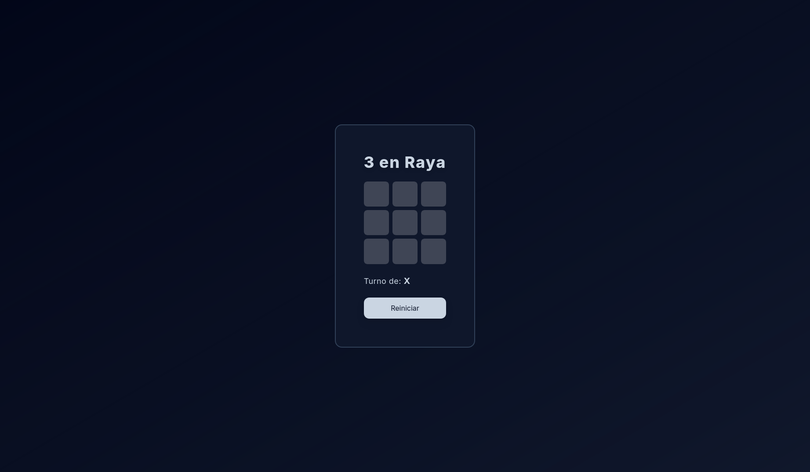

# React Practice Project (Hooks)

[Versión en español](./README.md)





Project created to practice React with TypeScript using Vite.

The main focus is to reinforce:

- `useState` for local state management.

- `useEffect` for secondary effects and cleanup.

- Separation of responsibilities with `components`, `hooks`, and `utils`.

## Project Modules

### 1) Counter

Location: `src/Counter/`

Practice Objectives:

- Update numeric state with increment/decrement actions.

- Display temporary alerts when attempting to decrease from 0.
- Extract business logic to hooks (`useCounter`) and utilities (`counterHelpers`).

### 2) Tic-Tac-Toe

Location: `src/TicTacToe/`

Practice Objectives:

- Dynamic rendering of the board.

- Turn management (`X`/`O`) and winner detection.

- Game state control (reset, winner modal, etc.).

## General Structure

```txt
src/
components/
Container.tsx
Counter/
components/
hooks/
utils/
page.tsx
TicTacToe/
components/
hooks/
utils/
page.tsx
App.tsx
main.tsx
```

## Scripts

- `npm run dev`: Starts the development environment.

- `npm run build`: Compiles TypeScript and generates a production build.

- `npm run lint`: Checks for best practices with ESLint.

- `npm run preview`: Runs the build for local preview.

## Installation and Execution

1. Install dependencies:

```bash
npm install
```

2. Run in development:

```bash
npm run dev
```

## Stack

- React
- TypeScript
- Vite
- ESLint
- Tailwind CSS

## Learning Notes

This repo is not intended to be a final production app, but rather a guided practice space to solidify hooks and improve code quality step by step (consistent names, clear logic, and clean linting).

## Additional Information

**Author:** [Fravelz](https://github.com/fravelz)
